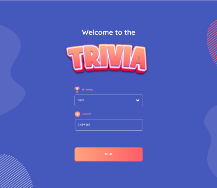

[Contributors][contributors-url]
[Forks][forks-url]
[Stargazers][stars-url]
[Issues][issues-url]
[Twitter][twitter-url]

# Trivia

Project was a test task and available to fork and change.



## Requirements

Nodejs: higher than(or equal) v12
NPM: higher than(or equal) v6

```
Why are these requirements?

There is a problem with old nodejs and npm environment. In this project, the React version is 18.2.0. Please make sure to upgrade your environment. If you don't want to upgrade your environment, you can run

 npm install --legacy-peer-deps (or yarn --legacy-peer-deps)
```

## Available Scripts

In the project directory, you can run:

### `yarn start`

Runs the app in the development mode.
Open [http://localhost:3000](http://localhost:3000) to view it in the browser

### yarn run deploy

Deploys to the gh-pages automatically. In the package.json, there is a hompage key that you have to update it according to your own repo details. Plus, make sure whether gh-pages is selected or not in your settings of a repo

## Note

In env file, you can see base url and if you want to change it, you can directly change the url, however, make sure to terminate current localhost and run "npm start" (or yarn start). If the base url is undefined, it will throw error on the console.

<!-- MARKDOWN LINKS & IMAGES -->

<!-- https://www.markdownguide.org/basic-syntax/#reference-style-links -->

[contributors-shield]: https://img.shields.io/github/contributors/curious-33/trivia
[contributors-url]: https://github.com/curious-33/trivia/graphs/contributors
[forks-shield]: https://img.shields.io/github/forks/curious-33/trivia?style=social
[forks-url]: https://github.com/curious-33/trivia/network/members
[stars-shield]: https://img.shields.io/github/stars/curious-33/trivia?style=social
[stars-url]: https://github.com/curious-33/trivia/stargazers
[issues-shield]: https://img.shields.io/github/issues/curious-33/trivia
[issues-url]: https://github.com/curious-33/trivia/issues
[twitter-shield]: https://img.shields.io/twitter/follow/curious_333?logoColor=blue&style=social
[twitter-url]: https://twitter.com/curious_333
